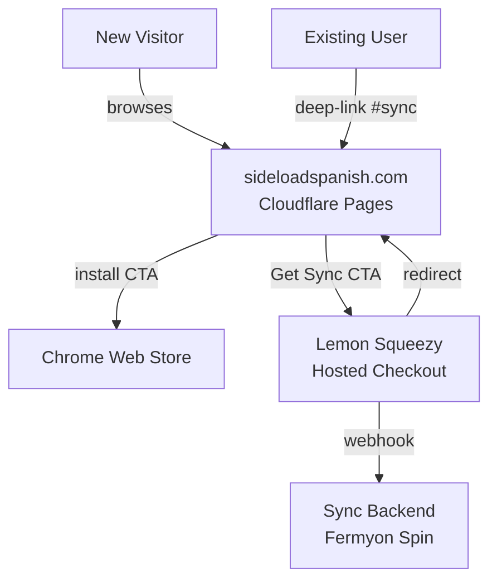
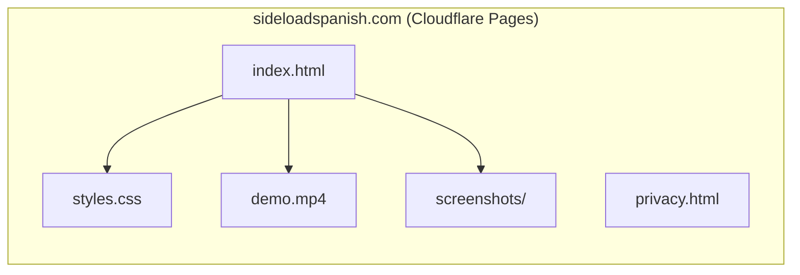
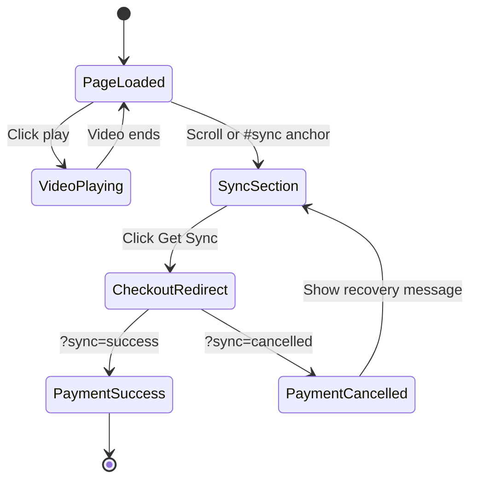

# Solution Design Document

## Validation Checklist

### CRITICAL GATES (Must Pass)

- [x] All required sections are complete
- [x] No [NEEDS CLARIFICATION] markers remain
- [x] Architecture pattern is clearly stated with rationale
- [x] **All architecture decisions confirmed by user**
- [x] Every interface has specification

### QUALITY CHECKS (Should Pass)

- [x] All context sources are listed with relevance ratings
- [x] Project commands are discovered from actual project files
- [x] Constraints → Strategy → Design → Implementation path is logical
- [x] Every component in diagram has directory mapping
- [x] Error handling covers all error types
- [x] Quality requirements are specific and measurable
- [x] Component names consistent across diagrams
- [x] A developer could implement from this design

---

## Constraints

- **CON-1** Solo developer. One person builds, deploys, and maintains. Complexity budget is minimal.
- **CON-2** Privacy brand commitment. Zero third-party scripts on page load. No cookies. No tracking pixels. This is a marketing differentiator enforced at the architecture level.
- **CON-3** Static site only. No SSR, no database, no CMS. Deployed as static files to a CDN.
- **CON-4** Payment provider is Lemon Squeezy. Already wired into `sync-worker/spin.toml` via `lemon_webhook_secret`. Non-negotiable.
- **CON-5** Launch timeline. Must be live before Week 2 launch spike (Reddit, HN, Product Hunt).

## Implementation Context

### Required Context Sources

#### Documentation Context
```yaml
- doc: .start/specs/001-sideload-spanish-landing-page/requirements.md
  relevance: CRITICAL
  why: "PRD defines all page sections, acceptance criteria, and success metrics"

- doc: .start/ideas/2026-04-09-loadlang-marketing-strategy.md
  relevance: HIGH
  why: "Approved copy, messaging framework, and launch content"
```

#### Code Context
```yaml
- file: sideload/manifest.json
  relevance: MEDIUM
  why: "Extension metadata, version, permissions — referenced by landing page"

- file: sideload/store/listing.md
  relevance: MEDIUM
  why: "Chrome Web Store listing copy — must align with landing page messaging"

- file: sync-worker/spin.toml
  relevance: HIGH
  why: "Confirms Lemon Squeezy as payment provider via lemon_webhook_secret"
```

#### External APIs
```yaml
- service: Lemon Squeezy
  doc: https://docs.lemonsqueezy.com/guides/checkout
  relevance: HIGH
  why: "Hosted checkout page for sync subscription (€5/mo)"

- service: Cloudflare Pages
  doc: https://developers.cloudflare.com/pages/
  relevance: HIGH
  why: "Static site hosting target"
```

### Implementation Boundaries

- **Must Preserve**: Extension manifest, store listing, sync-worker backend — landing page is additive, not modifying existing code.
- **Can Modify**: Nothing in the existing codebase. This is a new static site alongside the extension.
- **Must Not Touch**: `sync-worker/`, `sideload/` extension code, any backend logic.

### External Interfaces

#### System Context Diagram



#### Interface Specifications

```yaml
# Outbound Interfaces (what the landing page links to)
outbound:
  - name: "Chrome Web Store"
    type: HTTPS
    format: URL redirect (new tab)
    authentication: None
    data_flow: "Install CTA opens CWS listing page"
    criticality: HIGH

  - name: "Lemon Squeezy Hosted Checkout"
    type: HTTPS
    format: URL redirect
    authentication: None (checkout URL contains product ID)
    data_flow: "'Get Sync' CTA redirects to LS hosted checkout; LS redirects back on completion/cancellation"
    criticality: HIGH

# Inbound Interfaces (what sends traffic to the site)
inbound:
  - name: "Extension deep-link"
    type: HTTPS
    format: URL with #sync anchor
    data_flow: "Extension popup/settings links to sideloadspanish.com#sync"

  - name: "Lemon Squeezy redirect-back"
    type: HTTPS
    format: URL with query parameters (?sync=success or ?sync=cancelled)
    data_flow: "After payment completion or cancellation, LS redirects to landing page"
```

### Project Commands

```bash
# Core Commands (new — no existing build system for the site)
Dev:     npx serve site/    # or python3 -m http.server 8080 --directory site/
Build:   (none — static files, no build step needed at launch)
Deploy:  npx wrangler pages deploy site/ --project-name sideloadspanish
Lint:    npx html-validate site/index.html  # optional
```

## Solution Strategy

- **Architecture Pattern:** Single static HTML page deployed to a CDN. No JavaScript framework, no build toolchain, no server-side logic. Progressive enhancement for optional JS features (smooth scroll, video lazy-load).
- **Integration Approach:** The landing page is a standalone static site. It integrates with the extension ecosystem only through outbound links (CWS install, Lemon Squeezy checkout) and inbound anchors (extension deep-link to #sync).
- **Justification:** A static page is the simplest architecture that meets all PRD requirements. It loads fast (no JS bundle), respects privacy (no scripts to audit), is cheap to host (free CDN tier), and can be built by one person in days. The privacy brand commitment makes a no-JS-by-default architecture a feature, not a limitation.
- **Key Decisions:** See Architecture Decisions section below.

## Building Block View

### Components



### Directory Map

**Component**: site (new — root of the landing page)
```
site/
├── index.html              # NEW: Single-page landing (all 7 sections)
├── privacy.html            # NEW: Privacy policy page
├── styles.css              # NEW: All styles (CSS custom properties)
├── assets/
│   ├── demo.mp4            # NEW: 60s self-hosted demo video
│   ├── demo-poster.jpg     # NEW: Video poster/fallback image
│   ├── screenshot-1.png    # COPY: From sideload/store/
│   ├── screenshot-2.png    # COPY: From sideload/store/
│   ├── screenshot-3.png    # COPY: From sideload/store/
│   └── favicon.ico         # NEW: Site favicon
└── _headers                # NEW: Cloudflare Pages headers (CSP, cache)
```

### User Interface & UX

**Page Structure (index.html):**
```
┌─────────────────────────────────────────┐
│  <header> — sticky nav (optional)       │
│  Logo + Install CTA                     │
├─────────────────────────────────────────┤
│  <section id="hero">                    │
│  Headline + Subhead + CTA + Video       │
├─────────────────────────────────────────┤
│  <section id="how-it-works">            │
│  3-panel grid (flexbox)                 │
├─────────────────────────────────────────┤
│  <section id="features">               │
│  4-bullet feature list                  │
├─────────────────────────────────────────┤
│  <section id="privacy">                │
│  Privacy promise + GitHub link          │
├─────────────────────────────────────────┤
│  <section id="sync">                    │
│  Sync pitch + price + Get Sync CTA      │
├─────────────────────────────────────────┤
│  <footer>                               │
│  LoadLang + GitHub + Privacy + Languages │
└─────────────────────────────────────────┘
```

**Responsive Breakpoints:**
- Desktop: >= 769px — horizontal How It Works panels, side-by-side layouts
- Mobile: <= 768px — stacked panels, install CTA swapped to "Available on Chrome for desktop" (disabled)

**Mobile Detection:**
```
CSS media query for layout changes.
UA-based detection for CTA swap (CSS-only via width is 
preferred; UA sniffing only if CSS can't distinguish 
tablet-with-keyboard from phone).
```

**Interaction States:**



**Accessibility:**
- WCAG AA compliance (4.5:1 contrast body text, 3:1 large text)
- All interactive elements keyboard-navigable with visible focus rings
- Video has captions/transcript
- `#sync` section has `aria-label="Sync upgrade"`
- No autoplay with sound; muted autoplay with visible controls

## Runtime View

### Primary Flow: New Visitor Install

1. Visitor lands on sideloadspanish.com (from Reddit/HN/ProductHunt link)
2. Page loads as static HTML — no JS required for content or CTAs
3. Visitor reads hero, optionally plays demo video
4. Visitor scrolls through How It Works → Features → Privacy
5. Visitor clicks "Add to Chrome — free, no signup"
6. Chrome Web Store listing opens in new tab
7. Visitor installs extension from CWS

### Secondary Flow: Sync Upgrade

1. Existing user clicks "Get Sync" in extension popup
2. Browser navigates to sideloadspanish.com#sync
3. Page loads with viewport scrolled to #sync section (CSS `:target` or minimal JS smooth scroll)
4. User reads sync value prop, sees €5/month pricing
5. User clicks "Get Sync" button
6. Browser redirects to Lemon Squeezy hosted checkout page (no embedded JS)
7. User completes payment on Lemon Squeezy
8. Lemon Squeezy redirects back to sideloadspanish.com?sync=success
9. Page shows a confirmation message in the #sync section (via CSS `:target` or minimal `<noscript>`-safe query param handling)
10. Lemon Squeezy sends webhook to sync backend independently

### Error Handling

| Error | Behavior |
|-------|----------|
| Video fails to load | `<video>` poster image displays as fallback; alt text visible |
| CWS link unavailable | Button remains a standard anchor link — browser shows its own error page. No special handling needed (CWS downtime is rare and transient). |
| Lemon Squeezy checkout fails | User stays on LS domain; LS handles error messaging. On cancellation, redirects to `?sync=cancelled` — page shows soft recovery message. |
| JavaScript disabled | All content renders. CTAs work as plain `<a>` links. Video shows poster image. Smooth scroll degrades to instant anchor jump. |
| Ad blocker active | Self-hosted video avoids blocking. No third-party scripts to block. |

### Payment Return URL Handling

The page needs to handle three URL states with zero JavaScript dependency:

```html
<!-- Success message: visible only when ?sync=success is in URL -->
<!-- Implementation: CSS-only using a hidden input + :checked trick,
     or a minimal inline <script> that shows/hides a div.
     Simplest: just show a thank-you page at /sync-success.html
     and set that as the LS return URL. -->

<!-- Option A (recommended): Separate thank-you page -->
site/sync-success.html  →  "You're all set! Sync is active."
                            Link back to main page.

<!-- Option B: Query param + minimal JS -->
<div id="sync-success" hidden>Thanks! Sync is now active.</div>
<script>
  if (location.search.includes('sync=success'))
    document.getElementById('sync-success').hidden = false;
</script>
```

**Recommendation:** Option A (separate page). Zero JS, cleaner UX, and the LS return URL is simply `https://sideloadspanish.com/sync-success.html`.

## Deployment View

### Static Site Deployment

- **Environment:** Cloudflare Pages (free tier). Global CDN, automatic HTTPS, no egress fees.
- **Deploy method:** `npx wrangler pages deploy site/` or Cloudflare Pages Git integration (connect to repo, auto-deploy on push to main).
- **Domain:** sideloadspanish.com → Cloudflare DNS → Cloudflare Pages custom domain.
- **Configuration:** No environment variables needed. The site is pure static HTML.
- **Cache:** Cloudflare CDN handles caching. Set `Cache-Control: public, max-age=3600` for HTML, `max-age=31536000, immutable` for hashed assets.

### `_headers` file (Cloudflare Pages)

```
/*
  X-Frame-Options: DENY
  X-Content-Type-Options: nosniff
  Referrer-Policy: strict-origin-when-cross-origin
  Content-Security-Policy: default-src 'self'; media-src 'self'; img-src 'self'; style-src 'self'; script-src 'none'

/sync-success.html
  Content-Security-Policy: default-src 'self'; media-src 'self'; img-src 'self'; style-src 'self'; script-src 'none'
```

Note: `script-src 'none'` enforces the zero-JS commitment at the browser level. If Option B (query param JS) is chosen for payment return, this must be relaxed to `script-src 'self'`.

### Performance Targets

| Metric | Target | How |
|--------|--------|-----|
| LCP | < 2.5s | Static HTML, CDN-cached, no JS blocking render |
| FCP | < 1.5s | Above-the-fold content is pure HTML/CSS |
| CLS | < 0.1 | All images have explicit width/height; video has poster |
| Total page weight | < 2MB | Compressed video (~5-8MB raw, lazy-loaded), lightweight HTML/CSS |

## Cross-Cutting Concepts

### Security
- **CSP header** enforces no inline scripts, no third-party resources
- **No user data** collected or stored by the landing page
- **HTTPS only** via Cloudflare
- **No cookies** — nothing to consent to, no banner needed
- Payment data never touches the landing page — handled entirely by Lemon Squeezy

### Error Handling Pattern
- **Progressive degradation:** Every feature has a no-JS fallback. Video → poster image. Smooth scroll → anchor jump. Payment return → separate page.
- **No error states that require JS:** All error recovery is handled by the external service (CWS, Lemon Squeezy) or by static HTML.

### Pattern: Privacy-First Static Site
```yaml
- pattern: Zero third-party scripts on page load
  relevance: CRITICAL
  why: "Brand differentiator — 'no telemetry' claim must be verifiable in browser DevTools Network tab"

- pattern: Progressive enhancement
  relevance: HIGH
  why: "Page must work without JS — privacy-conscious users may have JS disabled"
```

## Architecture Decisions

- [x] **ADR-1 Hosting: Cloudflare Pages (free tier)**
  - Rationale: Static site needs only CDN hosting. Cloudflare Pages is free, global, auto-HTTPS, zero egress. Sync backend already on Fermyon Spin — keeping hosting separate avoids coupling.
  - Trade-offs: Tied to Cloudflare ecosystem. Migration to Netlify/Vercel is trivial (just static files).
  - User confirmed: ✅

- [x] **ADR-2 Framework: Plain HTML/CSS (no framework)**
  - Rationale: Single marketing page with 7 sections, no CMS, no routing, no dynamic content. A framework adds build complexity, dependency maintenance, and JS bundle for zero benefit. Privacy commitment is enforced by architecture (CSP `script-src: 'none'`), not discipline.
  - Trade-offs: If the site grows to multi-page with shared components, migration to Astro is ~2 hours of work.
  - User confirmed: ✅

- [x] **ADR-3 Payments: Lemon Squeezy hosted checkout (redirect, not overlay)**
  - Rationale: Already wired into sync backend (`spin.toml`). LS acts as Merchant of Record (handles EU VAT). Redirect-based checkout means zero LS JavaScript on the landing page — preserving the privacy commitment.
  - Trade-offs: Redirect leaves the site during checkout (user goes to LS domain). Overlay would keep them on-site but requires embedding LS JS.
  - User confirmed: ✅

- [x] **ADR-4 Analytics: None at launch**
  - Rationale: Landing page copy says "No telemetry. No analytics." — adding analytics would undermine the brand story shared on Reddit and HN. Conversion tracking comes from Lemon Squeezy dashboard (payment completions) and Chrome Web Store dashboard (installs).
  - Trade-offs: No funnel visibility (page views, scroll depth, CTA clicks). Cloudflare Web Analytics (cookieless, edge-processed) is the fallback if data becomes necessary.
  - User confirmed: ✅

## Quality Requirements

| Category | Requirement | Measurement |
|----------|-------------|-------------|
| Performance | LCP < 2.5s on 3G | Lighthouse score >= 90 |
| Performance | Total page weight < 2MB (excluding lazy-loaded video) | DevTools Network tab |
| Accessibility | WCAG AA compliance | axe-core audit with 0 violations |
| Security | Zero third-party requests on page load | DevTools Network tab shows only sideloadspanish.com requests |
| Security | CSP header blocks inline/external scripts | CSP report-only mode test |
| Privacy | No cookies set | DevTools Application > Cookies is empty |
| Reliability | Page renders fully with JS disabled | Manual test with JS disabled in browser |

## Acceptance Criteria (EARS Format)

**Install Flow:**
- [x] WHEN a visitor clicks the install CTA, THE SYSTEM SHALL open the Chrome Web Store listing in a new tab
- [x] WHILE the visitor is on a mobile device (viewport <= 768px), THE SYSTEM SHALL display the install CTA as disabled with text "Available on Chrome for desktop"

**Sync Flow:**
- [x] WHEN a user navigates to sideloadspanish.com#sync, THE SYSTEM SHALL scroll the viewport to the sync section
- [x] WHEN a user clicks "Get Sync", THE SYSTEM SHALL redirect to the Lemon Squeezy hosted checkout page
- [x] WHEN a user completes payment and is redirected to /sync-success.html, THE SYSTEM SHALL display a confirmation message

**Privacy:**
- [x] THE SYSTEM SHALL serve zero third-party scripts on page load
- [x] THE SYSTEM SHALL set CSP headers blocking inline and external scripts
- [x] THE SYSTEM SHALL set zero cookies

**Progressive Enhancement:**
- [x] WHILE JavaScript is disabled, THE SYSTEM SHALL render all content and CTAs as functional anchor links
- [x] WHEN the demo video fails to load, THE SYSTEM SHALL display a poster image with alt text

## Risks and Technical Debt

### Implementation Gotchas

- **Lemon Squeezy checkout URL format:** The "Get Sync" CTA needs a product-specific checkout URL from the LS dashboard. This must be configured before launch — it's not in the codebase yet.
- **Video compression:** The 60s demo video must be aggressively compressed (target ~5MB) to avoid slow page loads. Consider H.265 with H.264 fallback for browser compatibility.
- **`#sync` anchor scroll on page load:** If the page is loaded with `#sync` in the URL, the browser will jump to the anchor before CSS is fully parsed, potentially causing a flash. Use `scroll-margin-top` on the section to account for any sticky header.
- **Cloudflare Pages `_headers` file:** Must be in the deploy root (`site/`), not the project root. Easy to misplace.

### Known Limitations

- No install tracking beyond CWS dashboard — cannot attribute installs to specific channels without analytics.
- No A/B testing capability without adding JS. If messaging experiments are needed, deploy separate pages and compare.
- Payment return handling relies on user being redirected back — if they close the LS checkout tab, no confirmation is shown (but sync activates via webhook regardless).

## Glossary

### Domain Terms

| Term | Definition | Context |
|------|------------|---------|
| Sideload Spanish | Chrome extension that replaces English words with Spanish on web pages | The product being marketed by this landing page |
| LoadLang | Parent brand / umbrella company making language learning extensions | Attributed in footer as "A LoadLang product" |
| Sync | E2E encrypted multi-device vocabulary progress synchronization | Paid feature at €5/mo, primary revenue driver |
| Tier | CEFR-aligned difficulty level (A1–C1) grouping vocabulary words | Referenced in Features section |

### Technical Terms

| Term | Definition | Context |
|------|------------|---------|
| Cloudflare Pages | Static site hosting service with global CDN | Hosting platform for sideloadspanish.com |
| Lemon Squeezy | Payment platform acting as Merchant of Record | Handles checkout, billing, EU VAT for sync subscriptions |
| Fermyon Spin | WebAssembly serverless platform | Hosts the sync backend (separate from landing page) |
| CSP | Content Security Policy — HTTP header controlling resource loading | Enforces zero third-party scripts |
| LCP | Largest Contentful Paint — Core Web Vital measuring load performance | Target: < 2.5s |
| MoR | Merchant of Record — entity legally selling to the customer | Lemon Squeezy acts as MoR, handling tax compliance |
